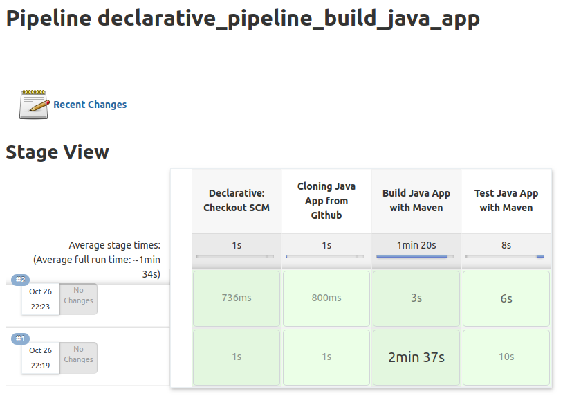

BUILDING JAVA APP
---------------------------------------------------------------------------------------------------------

**Se agrega stage para recuperar una aplicación Java desde un repositorio Git:** 

```

    stage("Cloning Java App from Github") {
        steps {
            echo "Cloning Java App..."
            git 'https://github.com/edgar-code-repository/spring-boot-countries-rest-api'
        }
    }

```

-----------------------------------------------------------------------------------------------------------

**Se agregan stages para construir y testear la aplicación utilizando Maven:**

```

    stage("Build Java App with Maven") {
        steps {
            echo "Building Java App..."
            sh '''
                mvn -DskipTests clean package
            '''
        }
    }

    stage("Test Java App with Maven") {
        steps {
            echo "Testing Java App..."
            sh '''
                mvn test
            '''
        }           
    }


```

-----------------------------------------------------------------------------------------------------------

**Se crea pipeline en Jenkins:**


-----------------------------------------------------------------------------------------------------------

**Se configura pipeline para leer Jenkinfile desde un repositorio Git:**


-----------------------------------------------------------------------------------------------------------

**Stage view mostrado por Jenkins despues de ejecutar pipeline:**



-----------------------------------------------------------------------------------------------------------