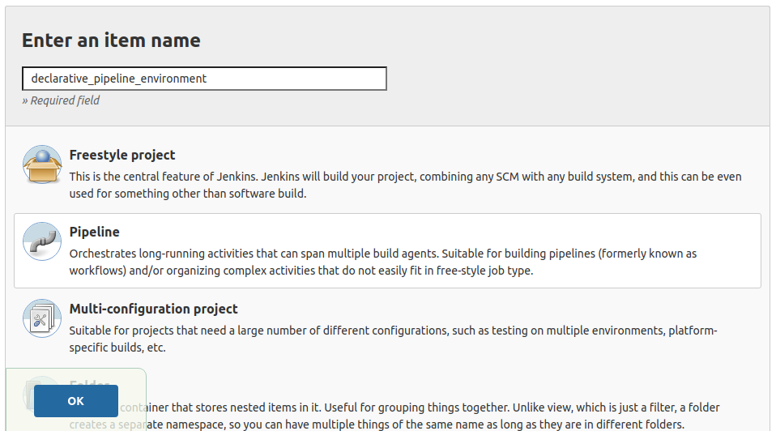
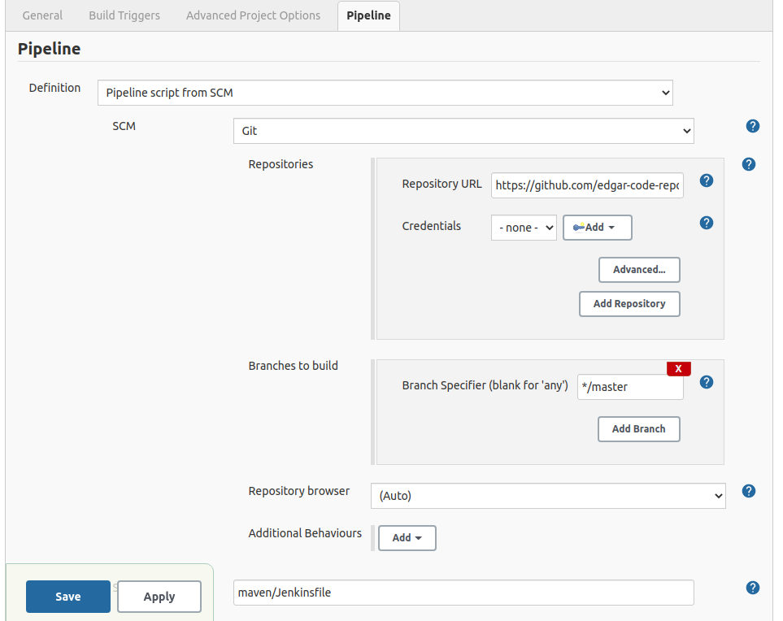
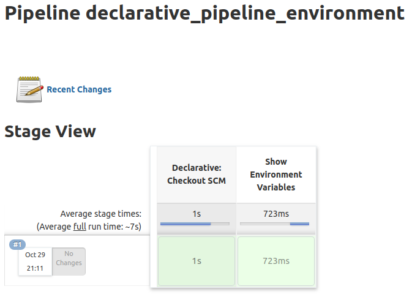

ENVIRONMENT SECTION
---------------------------------------------------------------------------------------------------------

**Se declara sección environment en Jenkinsfile incluyendo en variable PATH la ruta de Java 8 y Maven:**

```

pipeline {
    agent any

    environment {
        PATH = "/usr/lib/jvm/jdk1.8.0_202/bin:/usr/share/maven/bin:${PATH}"
    }

    stages {
        stage ('Show Environment Variables') {
            steps {
                sh '''
                    echo "PATH = ${PATH}"
                    java -version
                    mvn -version
                ''' 
            }
        }
    }

}

```

-----------------------------------------------------------------------------------------------------------

**Se crea pipeline en Jenkins:**



-----------------------------------------------------------------------------------------------------------

**Se configura pipeline para leer Jenkinfile desde un repositorio Git:**



-----------------------------------------------------------------------------------------------------------

**Stage view mostrado por Jenkins despues de ejecutar pipeline:**



-----------------------------------------------------------------------------------------------------------