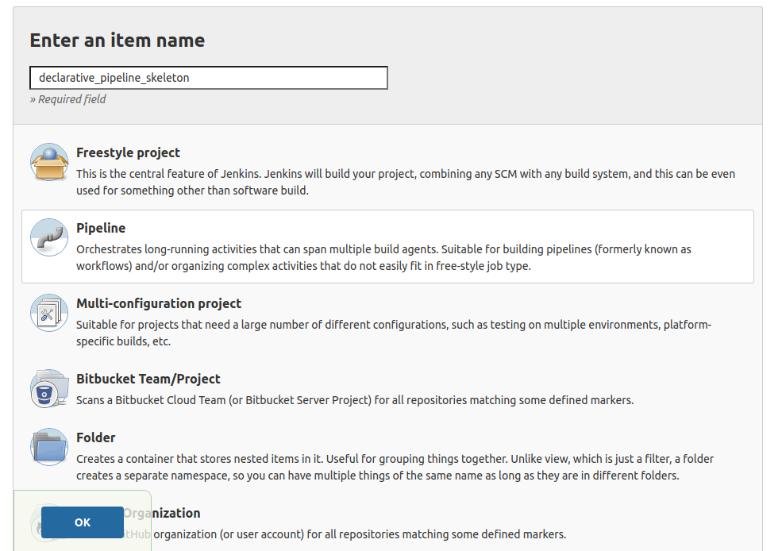
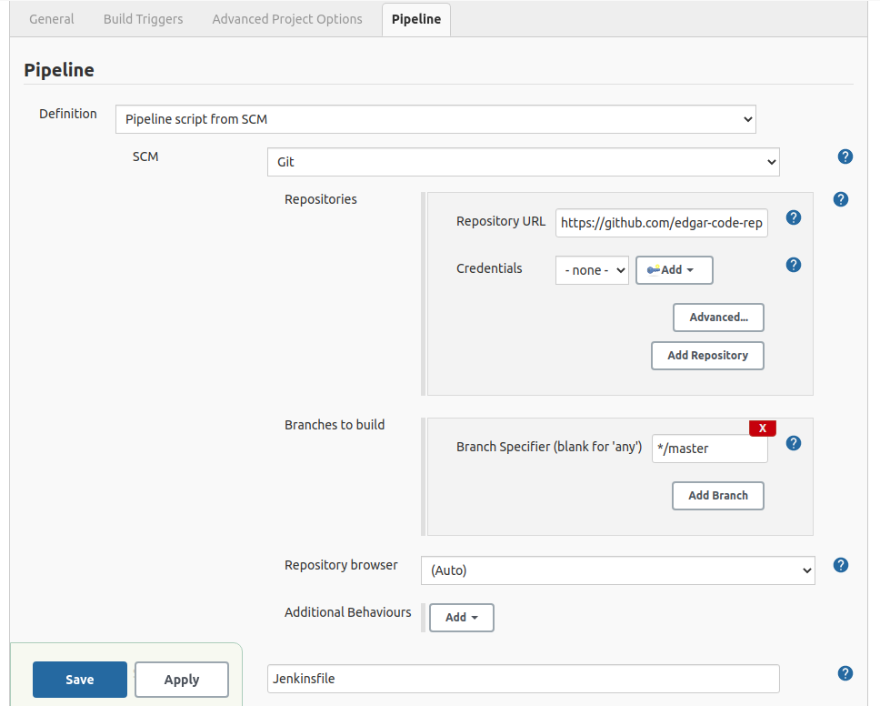
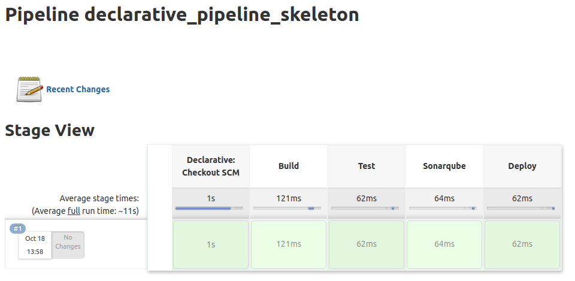

JENKINSFILE SKELETON
---------------------------------------------------------------------------------------------------------

**Jenkinsfile skeleton:**

```

pipeline {
    agent any

    stages {
        stage("Build") {
            steps {
                echo "Building stage is running..."
            }
        }

        stage("Test") {
            steps {
                echo "Testing stage is running..."
            }
        }

        stage("Sonarqube") {
            steps {
                echo "Sonarqube stage is running..."
            }
        }

        stage("Deploy") {
            steps {
                echo "Deploying stage is running..."
            }
        }        
    }

}

```

-----------------------------------------------------------------------------------------------------------

**Se crea pipeline en Jenkins:**



-----------------------------------------------------------------------------------------------------------

**Se configura pipeline para leer Jenkinfile desde un repositorio Git:**



-----------------------------------------------------------------------------------------------------------

**Stage view mostrado por Jenkins despues de ejecutar pipeline:**



-----------------------------------------------------------------------------------------------------------