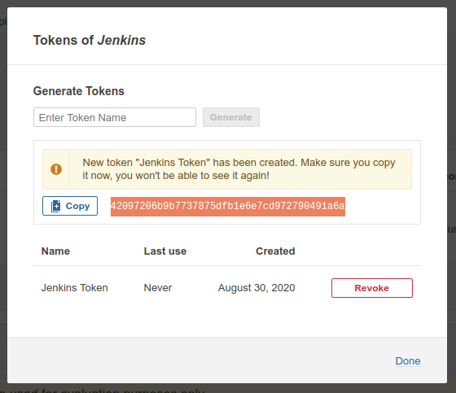
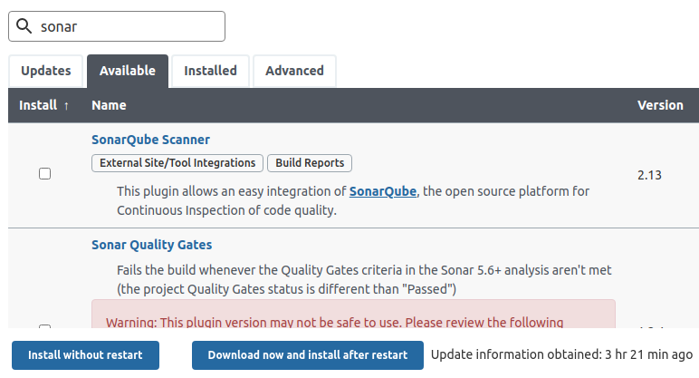
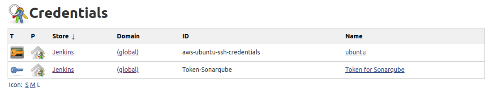
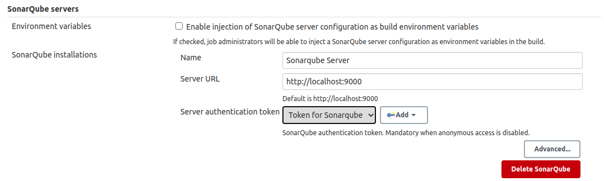
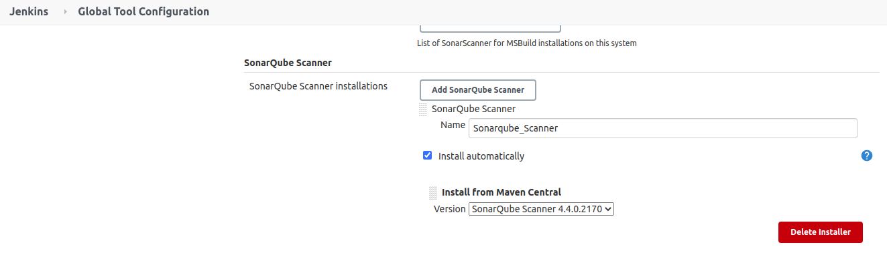

SONARQUBE AND JENKINS CONFIGURATION
---------------------------------------------------------------------------------------------------------

**Se genera token dentro de Sonarqube para ser utilizado desde Jenkins:**

-----------------------------------------------------------------------------------------------------------

**Se instala plugin SonarQube Scanner en Jenkins (Manage Jenkins -> Manage Plugins):**

-----------------------------------------------------------------------------------------------------------

**Se crea credencial tipo secret text para configurar token creado en Sonarqube** 

**(Manage Jenkins -> Manage Credentials)**

-----------------------------------------------------------------------------------------------------------

**Se configura servidor Sonarqube en Jenkins (Manage Jenkins -> Configure System):**

-----------------------------------------------------------------------------------------------------------

**Se configura SonarQube Scanner en Jenkins (Manage Jenkins -> Global Tool Configuration):**

-----------------------------------------------------------------------------------------------------------
